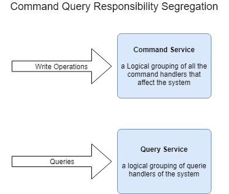
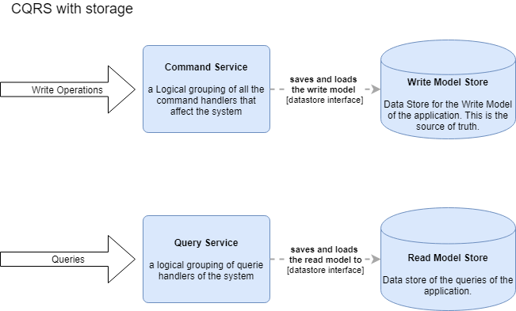
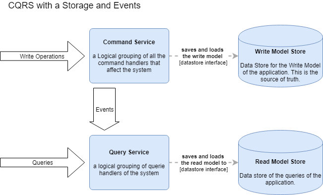
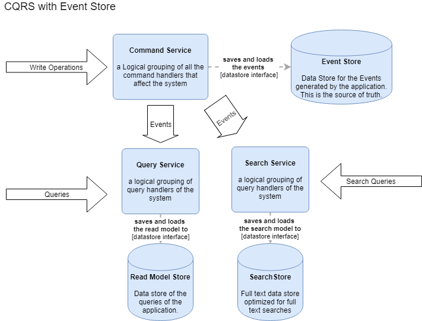
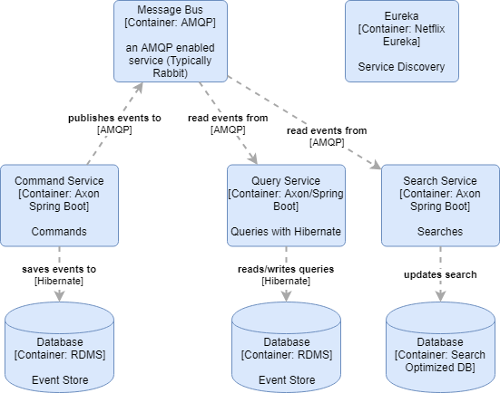
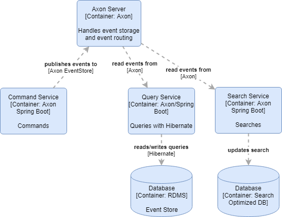

# CQRS/ES with Axon 4

## Introduction

With this document I will attempt to briefly explain CQRS and Event Sourcing and its fit in a microservices environment. and then subsequently the implemtation of these patterns in the Axon framework. 

## CQS?

To understand CQRS, it may help to start with an underlying concept first. 

“Every method should either be a command that performs an action, or a query that returns data to the caller, but not both. In other words, Asking a question should not change the answer.” - Bertrand Meyer

This is the concept of CQS or Command Query Seperation which was first introduced by Bertrand Meyer in his book on Object Oriented design. CQS basically states that asking a question of an object should not change the answer. This is achieved by applying the principle by seperating commands that change an object from queries which retrieves information from an object. For example :

```java
class Task {
    String id;
    String description;
}

interface TaskService {
    public Task createTask(task);
    public Task completeTask(taskId);
    public Task retrieveTask(taskId);
}

Task task = taskService.createTask(taskCreated);
Task task = TaskService.completeTask(taskId);
```
vs 

```java
interface TaskCommandService {
    public void createTask(task);
    public void completeTask(taskId);
}

interface TaskQueryService {
    public Task retrieveTask(taskId);
}

taskCommandService.createTask(task)
taskCommandService.completeTask(taskId);
Task task = TaskQueryService.retrieveTask(taskId);
```

The benefit is shown here where you can explicitely see that calling a method on the TaskQueryService should not change the task where calling a method on the TaskCommandService will change the task. Doing this allows the implementation of the interfaces to become cleaner as the responsibility of updating versus presenting the task is seperated. In addition on has more options of how to implement the code.

One drawback of this approach is that it results in more code. We now have two classes instead of one. This is important to note as the payment for more simple implementations, is a broader api and consequently more work. 

## CQRS

Seeing the benefit of the above in Object Oriented design, Greg Young and also Udi Dahan thought it would be a good idea to apply the principle on the service boundary of an application.  



Applying CQRS on the service boundary level means essentially the same thing as CQS which is applied on a Object interface level. You seperate the commands, or operations that mutates state, from the queries, operations that return values. As Greg Young states on his blog, there is nothing more to this concept than that. 

What is interesting is what this applying this simple concept enables to happen during implementation architecturally. an Imporatant realization is that even if the data that the application uses are the same, does not mean that the data model have to be the same for both the command side and the query side.



Seperating the write model from the query model, allows us to efficiently save the write model and save the query model in an optimized form for reading. An example of this would be where we are processing transactions and saving updates of transactions to the write model. In addition we also have the requirement of an End of Day report, which could run relatively slowly if we were to query over all the transactions of the day. But if we updated the read model of the End of Day report as the day progresses, the retrieval of the report will result in a simple read from the store instead of involving processing.

But how do you keep the query model in sync when all the commands are getting sent to the command service?



a Typical implemetation achieves synchronization by letting the Command handlers publish events, which the Query side handles and then uses to update the query model. The command side simply publishes the event without being concerned on how it is going to be handled. The query side responds the the event and builds a projection data model from it.

From this simple model you get a few benefits :

* You can independantly optimize the command and the query model of the application 
* The services are independently deployable, meaning you could have 2 command service instances and 25 read service instances to carry more load
* The query side can be implemented in different ways, for example a relation database model, a fulltext search model etc.

## Event Sourcing

The next step in this evolution came with the realization that the events that are published by the command handlers have to contain all the data of the command that is changing the state, since the consumers of the events get to decide which parts of the data is important for its projection. If one were to save the events that is published instead of saving the write/domain model, you can rebuild either the write/domain model or any of the query/projection models from the data.

This opens up a few possibilites that were not easily done before :

* Storage of the domain model becomes trivial, as we are simply appending events into the event store.
* Since we are storing the events that occurred in the application, we have an automatic audit.
* We can add additional projections at a later stage and build it's data model from when we started saving events. a Simple example here is if we wanted to add full text search 3 months after a system has gone live and include all the data from the previous 3 months, we can simply replay the events in the store and have them handled by an event handler that builds the projection. 



## Microservices

One essential tool that one needs in your belt when dealing with microservices is to be able to split services along lines that makes sense. There's many ways in which one can do this, with many advantages and disadvantages. CQRS is one of those techniques, and the architectural and implementation decisions that leads from this technique gives us a guideline and many benefits. 

As noted before, the biggest drawback of the techniques is the amount of additional work that needs to be done. This technique will surely not apply in all scenarios. In general, the biggest benefit is to be gained where these concepts are applied on complex domains. In order to reduce the cost of building the scaffolding needed to apply these conscepts, we can use a framework. An this is where Axon comes in.

## Axon 4

### Axon Framework

Axon attempts to help developers to apply these techniques by providing tested building blocks neccesary to be able to implement a solution in Java. This is provided in the form of the Axon Framework. Services implemented with Axon communicates using Messages. Messages take one of three different forms, either Command, Queries or Events. We will look at some of the differences that Axon defines between the 3 shortly.

### Location Transparency

Through the use of messages as the backbone communication, Axon applies the principle of Location Transparency. 

"A component should neither be aware of, nor make any assumptions about the location of components it interacts with." - Frans van Buul

What this essentially means is that any of the services should not need to care about the boiler plate neccesary to interact with any other component. The framework should take care of this. Axon provides the Command Gateway and the Query gateway interfaces to send commands and queries, where the framework implementation handles the way in which it is achived. 

### Axon Server

Axon Framework 3 only included the framework and the developers using the framework would configure message passing with either an AMQP provider and implement the event store with a Hbernate back end. Optionally one could use the database to pass messages between the services. 



In order for the services to discover each other, one needed to make use of something like Netflix Eureka. And then sending commands would become possible as Axon employed Spring Cloud Service Discovery in order to send commands to the right service.

Axon released their own version of an event store, called Axon DB, as a propriatary product at the start of 2018. In addition they released Axon Hub which handles the responsibility of routing messages effieciently to services. With Axon 4 they decided to release both these products as a single unit called Axon Server and open source the solution.



### Messaging

* Commands 
    - Commands are routed to a single handler 
    - Using consistent hashing, multiple commands for the same entity will end up on the same machine 
    - Provides result
* Events
    - Events will be distributed to all logical handlers
    - Each logical handler will receive one event even if mulitple instances exist 
    - Consumer express ordering requirements (example purchase order events should be in order)
    - No Result
* Queries
    - Routed with load balancing
    - Provides result
    - 3 different types : 
        - Point to Point - a query for an authoritive answer or one true answer - one destination 
        - Scatter/Gather Queries - an opinion of a component. Example lookup of price
        - Subscription Query - keep connection open for updates on the data of a query

## Demo

Document Resources

https://ordina-jworks.github.io/domain-driven%20design/2016/02/02/A-Decade-Of-DDD-CQRS-And-Event-Sourcing.html
https://axoniq.io/blog-overview/how-to-write-an-axon-application
https://dev.to/kspeakman/a-deconstruction-of-cqrs-apis-4df0
https://www.researchgate.net/publication/266659115_A_case_study_of_the_variability_consequences_of_the_CQRS_pattern_in_online_business_software
http://codebetter.com/gregyoung/2010/02/16/cqrs-task-based-uis-event-sourcing-agh/


Youtube resources

Axon 4 Product Launch - https://www.youtube.com/watch?v=d1nsaPpRSMA